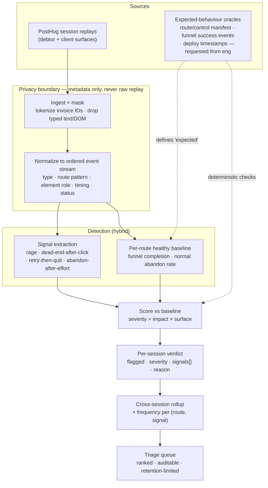

# PLAN.md — Catching AgentCollect UX bugs from PostHog replays (before anyone reports them)

> Committed before any solution code. This plans **how** I'd detect broken UX from session
> replays — not a fix, and not a hardcoded list of the bugs we already know about.

## The problem in one line
A "bug" here is rarely a crash. It's a button that does nothing, a control clicked 5 times in
frustration, a page abandoned after real effort. So the job isn't "find errors" — it's **infer
intent vs. outcome from behaviour**, and do it for bugs I'll never see in advance.

## Architecture — hybrid: generalizable signals + per-route healthy baseline
Two layers, deliberately. Either alone fails the brief.

1. **Signal layer (generalizes).** A small, composable set of *behaviour* signals that mean
   "the user wanted something and didn't get it" — independent of which feature broke. These
   carry severity.
2. **Baseline layer (kills false positives + catches the subtle).** Per `(surface, route)`,
   learn what a *healthy* session looks like from the corpus (funnel completion, typical
   click-to-progress, abandon rate). A signal only escalates when the session **deviates from
   that route's own baseline**. This is what lets me say *"this route suddenly degraded"*
   instead of trusting a raw `$rageclick` — a power user rage-clicking Export once is not a bug;
   a route where 40% of sessions now rage-click then abandon is.

Data flow: `traces.jsonl` → normalize to ordered events (metadata only, see Privacy) →
per-session signal extraction → score against the route baseline → per-session verdict
(`flagged`, `severity`, `signals[]`, one-line `reason`) → cross-session rollup for triage.

## Signals I'd start from (and why each generalizes)
None of these name a feature, so they fire on bugs I haven't seen:

- **Dead-end after intent** — an interaction (`$autocapture` click) followed by *no state
  change*: no new `$pageview`, no URL change, no success marker, then `$pageleave`. Catches the
  disabled/dead button (Replay B) without knowing the button exists.
- **Repeated identical action** — same element/target clicked N times with no differing outcome
  (covers `$rageclick`, but also slow N-click frustration that PostHog didn't tag).
- **Hard failure on a navigable target** — `$pageview status>=400` / `$exception` reached via a
  real in-product link (Replay A). High confidence *when present*, but `$exception`/`$dead_click`
  are unreliable in our data, so it's one signal among many, never the gate.
- **Abandon-after-effort** — meaningful interaction depth, then exit with **no success event**
  for that funnel (e.g. `/pay/.../success`, dispute `/submit`). The outcome-based catch-all that
  works even when no specific signal fires.
- **Retry-then-quit** — repeat the same step (e.g. `Confirm payment` twice, each followed by
  `$exception`) then leave: the strongest "I tried and it's broken" pattern.

Severity comes from how *blocked* the user ended up (recovered vs. abandoned), not from how loud
the signal was.

## How I judge "broken" — the expected-behaviour ground truth
The hard part: a 404 is obviously broken, but a button in the "wrong" state is only broken if I
know the state it *should* be in. I get that truth from two places, in order of cost:

1. **Ask product/eng for the oracles they already have.** A **route/control manifest** (valid
   routes; which controls *should* be enabled per page; what each funnel's success event is) is
   the cheapest, most unambiguous oracle — a 404 on a known nav link, or a disabled submit on the
   dispute page, becomes known-bad. I'd **request** this, not invent it from guesses. Same for
   release/deploy timestamps so I can correlate "degraded after deploy X."
2. **Healthy-session baseline (works today, no spec needed).** Where there's no manifest, derive
   expected behaviour empirically: the pay funnel normally ends in `/success`; the dispute funnel
   normally ends in `/submit`; nav links normally yield a non-error pageview. Deviation from a
   route's own healthy distribution is the signal. This degrades gracefully when eng is silent.

I treat raw signals as *evidence*, never verdicts — every flag is "deviates from expected,"
where "expected" is sourced, not assumed.

## Severity & prioritization — impact × frequency × surface
Split deliberately, because the detector scores **per session** but triage is **cross-session**:

- **Per-session severity = impact × surface** (computable from one trace):
  - *Impact*: fully blocked + abandoned > recovered-with-friction > minor.
  - *Surface*: debtor **payment** = highest stakes (money + PII), debtor **dispute** next, then
    **client dashboard/reports**, marketing lowest. A broken Pay button outranks a broken Export.
- **Cross-session frequency multiplier** (the rollup layer): how many distinct sessions hit the
  same `(route, signal)`. One session = could be a fluke; 30 sessions = ship a fix now. This is a
  triage booster on top of per-session severity — never a precondition for flagging, so a
  first-occurrence payment block still fires.

Output per session: `flagged`, `severity`, `signals[]`, `reason` (one line, e.g. *"clicked
'Reply / Submit dispute' 5×, no state change, abandoned — submit likely disabled"*).

## Privacy / compliance — debtor payment & dispute replays are real PII
- **Detector consumes event *metadata* only**: event type, route/path *pattern* (invoice IDs
  tokenized → `/pay/INV-***`), element role/text-from-our-own-UI, timing, status. **Never raw
  replay frames, DOM dumps, form values, or free text the user typed.** This is what makes "we
  don't touch PII" true rather than aspirational.
- **No raw replay to a third-party LLM.** If an LLM helps reason about ambiguous sequences, it
  runs **self-hosted / no-retention**, on already-masked metadata only — never a public API on
  debtor data.
- **Retention limits + provenance**: keep only the minimal event stream needed to reproduce a
  flag, expire it, and record why each flag fired so a human can audit.

## What I don't know yet (and what I'd do anyway)
Stated as questions, each with why / my default / what changes:

1. **Is there a route/control manifest (valid routes, expected control states, funnel success
   events)?**
   - *Why:* it's the cleanest expected-behaviour oracle and turns ambiguous flags into known-bad.
   - *Default if silent:* derive expected behaviour from the healthy-session baseline only.
   - *Changes if answered:* high-precision deterministic checks for known routes; baseline becomes
     the fallback for the long tail.

2. **Can I get deploy/release timestamps?**
   - *Why:* "this route degraded right after deploy X" is the highest-confidence, most actionable
     signal and separates a real regression from organic user confusion.
   - *Default:* treat each route's baseline as stationary over the window.
   - *Changes if answered:* add change-point detection keyed to deploys; sharply cuts false
     positives.

3. **What's the real signal availability — is `$rageclick`/`$pageleave`/`$autocapture` reliably
   present, and `$exception`/`$dead_click` genuinely sparse?**
   - *Why:* determines which signals I can lean on; a detector built on `$exception` would miss
     most real bugs (the README confirms this).
   - *Default:* assume `$exception`/`$dead_click` are unreliable; lead with rage/dead-end/abandon.
   - *Changes if answered:* reweight signals to whatever's actually dense.

4. **What's the cost of a false positive vs. a missed bug for the team triaging these?**
   - *Why:* sets the flag threshold — precision-first (quiet, trusted) vs. recall-first (catch
     everything, tolerate noise).
   - *Default:* precision-leaning; below threshold → don't flag rather than cry wolf.
   - *Changes if answered:* tune the threshold and whether borderline cases go to a review queue.

5. **Do healthy sessions span enough volume per route to baseline, and can sessions be segmented
   (new vs. returning, device)?**
   - *Why:* a baseline from 3 sessions isn't a baseline; segments stop me mislabelling first-time
     hesitation as a bug.
   - *Default:* global per-route baseline, flag low-confidence where volume is thin.
   - *Changes if answered:* per-segment baselines and confidence that scales with sample size.
